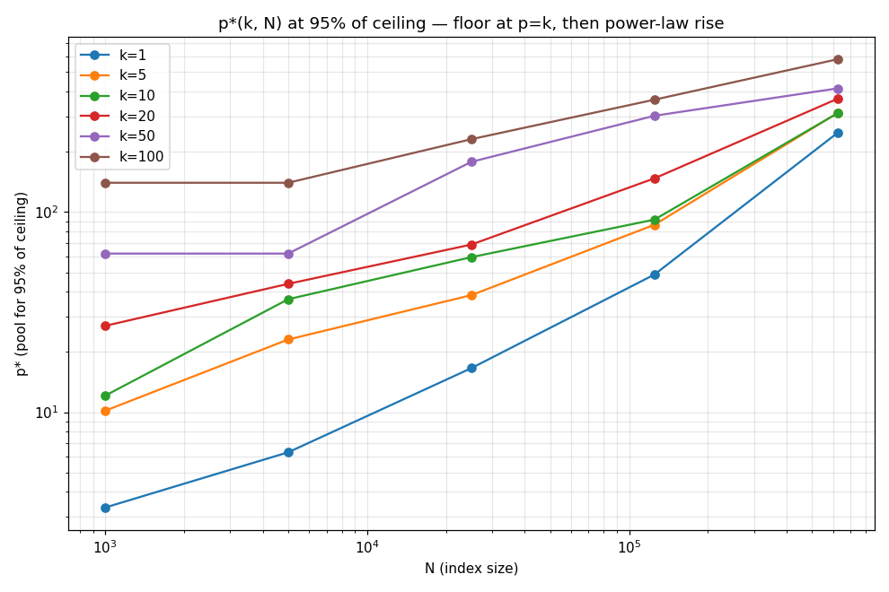
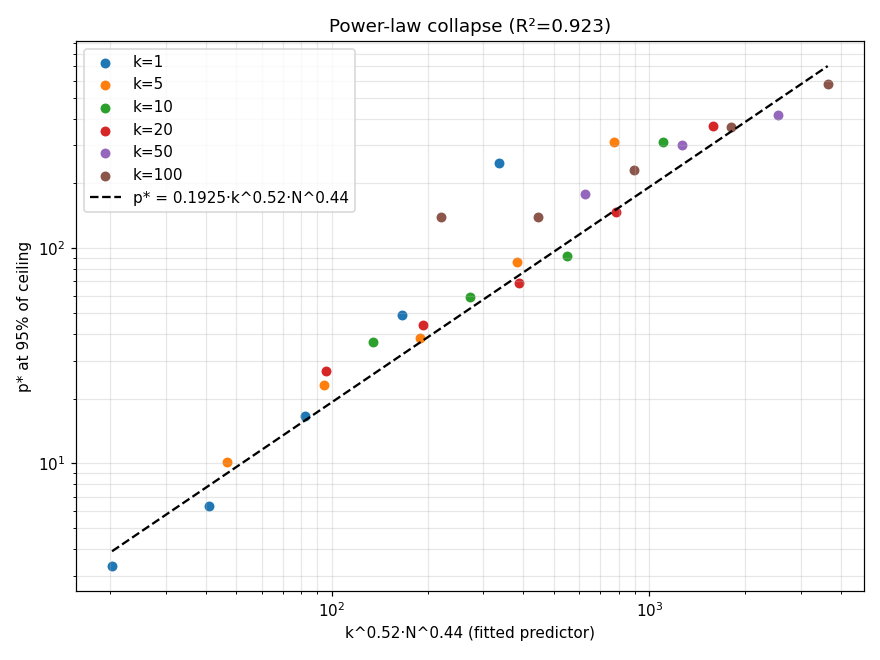
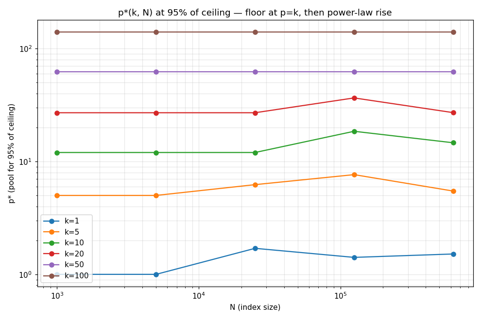
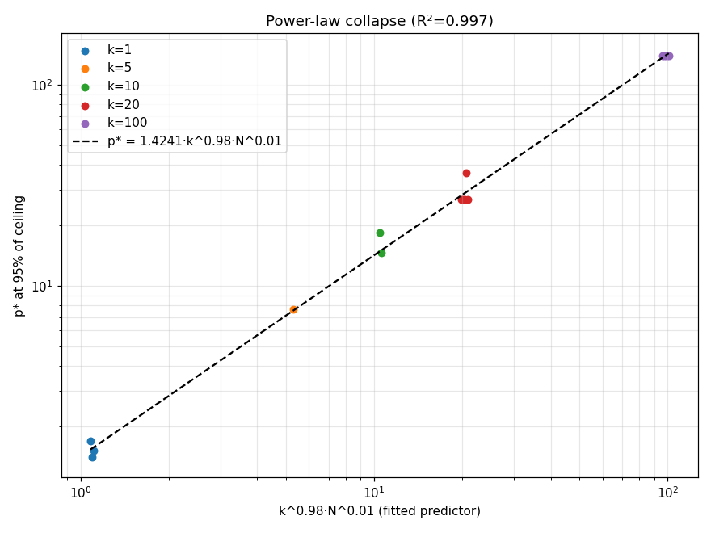
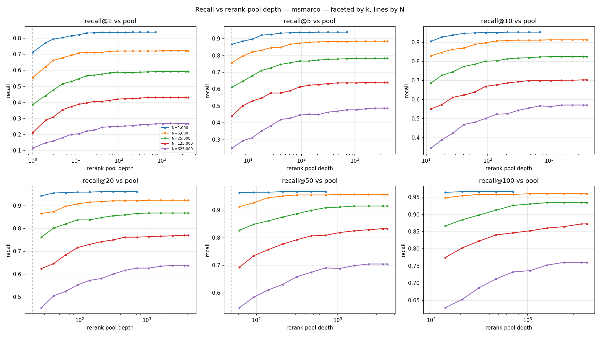
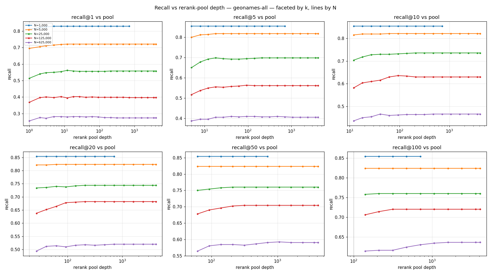

# Rerank pool-depth characterization

The rerank pool is the set of candidates the precision ranker rescores, and `p` is its depth.
A deeper pool can only help recall or leave it unchanged; once the right document is in the pool,
adding more does nothing. So recall climbs with `p` and then flattens. Write `p*(k, N, target)`
for the smallest pool that reaches a given fraction of that flat ceiling. The question is how
`p*` grows with the number of results `k` and the corpus size `N`, since that is what the
`Effort` knob has to follow.

Because recall only rises and then flattens, the average curve over queries has a clear knee, so
a plain average is enough here. (The [`t_max` sweep](../tmax-sweep) needs a per-query statistic
because its curve has a hump; this one does not.) The corpus sizes and the two corpora are the
same as in that report.

## Zipf's law and corpus scaling

Trigram frequencies follow Zipf's law. List a corpus's trigrams from most to least common; the
`r`-th one appears in about

```
DF(r) ≈ C · N / r^s,   with s ≈ 1
```

documents. A few trigrams are in almost every document, and a long tail are in only a few. Two
consequences set how deep the pool has to be.

First, a trigram's frequency grows with the corpus. The number of distinct trigrams grows
slowly as documents are added (Heaps' law, `vocabulary ∝ N^β` with `β < 1`), so most new
documents reuse trigrams already seen, and each trigram's document count `DF` grows roughly in
step with `N`. The fraction of documents a trigram appears in, `f = DF/N`, stays about the same
as the corpus grows; it depends on the language, not the corpus size. Rare-first selection keeps
the trigrams in a query with the smallest `f`, which are the cheapest to scan and the most
specific.

Second, those fractions set how much a random document overlaps a query by chance. A document's
overlap score is how many of the `t` selected query trigrams it contains. The right document
scores high because it really matches the query. Other documents score above zero by chance,
when they happen to share some of those trigrams. For a random document, that chance overlap is
roughly Poisson with mean

```
μ = Σ_{i=1..t} f_i
```

the sum of the selected trigrams' fractions. (Its variance is also about `μ`, since the trigrams
are nearly independent and each `f_i` is small.) Like the fractions, `μ` depends on the query
and the language, not on `N`.

The pool has to be deep enough to include the right document, so `p*` is essentially that
document's rank by overlap score: the number of other documents that score at least as high.
Whether that rank grows with `N` depends on where the right document sits relative to the chance
average `μ`.

For names (dense corpora), the right document is a near-exact match, so it contains the query's
rare trigrams and scores far above `μ`. For another document to score as high it would have to
contain those same rare trigrams, and the number that do is about `N · ∏ f_i` over them. That is
a product of small fractions, so it stays tiny and does not grow with `N` (the fractions are
fixed). The pool only has to be deep enough to hold the `k` results, so `p* ∝ k`, independent of
corpus size.

For prose (sparse corpora), the right document is a paraphrase, so it shares only a few of the
query's exact trigrams. Its score is modest and sits in the middle of the chance distribution
rather than above it. The documents that match or beat that score are a roughly fixed fraction
of the corpus, so their number grows with `N`, and the right document's rank grows with it. The
pool has to grow with `N` to keep the document in.

How fast does it grow? If documents were independent and the right one stayed at a fixed score
`θ`, the count above `θ` would be `N · P(S ≥ θ)`, which is linear in `N`. Real text is burstier
than that: trigrams cluster within documents instead of being spread evenly, so the number of
documents that reach a given score grows slower than `N`. The fitted exponent on `N` (next
sections) is below 1, and it rises with the recall target, passing through about ½ across the
90–99% range that production cares about.

That puts the pool depth at roughly `√(k·N)`, which is the form used. Two things set it: the
pool needs at least `k` candidates to return `k` results, and it needs extra depth to reach a
right document that ranks lower as `N` grows. `√(k·N)` is the geometric mean of the two. The
fitted exponents are consistent with ½ but do not prove it; they are noisy and trade off against
each other, and the R² of the log-log fit makes the agreement look better than it is. The real
spread is in the `c` column (its p10–p90 range). The case for `√(k·N)` is the reasoning above
and the cross-check later, not the R².

## Method

- `ranksweep` measures recall@k against pool depth, for each `N` and each corpus. One index is
  built per `N` and swept over a log-spaced range of pool sizes up to 4096.
- `p*(k, N, target)` is the smallest pool that reaches `target` times the deep-pool ceiling, for
  targets of 50, 90, 95, and 99%.
- The fit `p* = c · k^a · N^b` is taken over the rising part of the curve; `c = median(p* /
  √(kN))`, reported with its p10–p90 range.
- Corpus sizes 1k, 5k, 25k, 125k, 625k; `k` of 1, 5, 10, 20, 50, 100.
- Errors are measured in linear space. Both the free `k^a·N^b` fit and `√(kN)` are reported.
  `√(kN)` is the choice for the reasons in the derivation, not because of the fit: the exponents
  are noisy and the log-log R² overstates how well they pin down ½.

## MS MARCO (prose, sparse): `p* ∝ √(k·N)`

| target | c (med) | c (p10..p90) | fit `k^a·N^b` | R² |
|---|---|---|---|---|
| 50% | 0.040 | 0.008..0.198 | k^0.99 · N^0.00 | 0.999 |
| 90% | 0.051 | 0.039..0.192 | k^0.67 · N^0.32 | 0.924 |
| 95% | 0.122 | 0.088..0.206 | k^0.52 · N^0.44 | 0.923 |
| 99% | 0.481 | 0.267..0.751 | k^0.34 · N^0.53 | 0.931 |

The exponent on `N` rises with the recall target: 0.00, 0.32, 0.44, 0.53. To get half the
relevant documents you only need about `k` candidates, whatever the corpus size. The documents
that are harder to retrieve sit lower in the overlap ranking, and a bigger corpus has more
documents that out-score them by chance, so reaching them needs a deeper pool. Across the 90–99%
targets `a` and `b` are both close to ½, which is `√(k·N)`. The constant `c` rises from 0.04 to
0.48 across the targets. Treat the R² as a consistency check, not proof: a log-log fit makes the
agreement look tighter than it is. The honest spread is in the `c` column, from 0.088–0.206 at
the 95% target to 0.267–0.751 at 99% (a 2–3× range).




## GeoNames (structured names, dense): `p* ∝ k`, `N`-independent

| target | c (med) | fit `k^a·N^b` | R² |
|---|---|---|---|
| 50% | 0.047 | k^1.02 · N^0.00 | 1.000 |
| 90% | 0.047 | k^1.02 · N^0.00 | 1.000 |
| 95% | 0.024 | k^0.98 · N^0.01 | 0.997 |
| 99% | 0.061 | k^0.88 · N^0.21 | 0.918 |

The exponent on `N` is about 0 up to the 95% target, so the pool only needs to scale with `k`,
not with corpus size. It picks up a small `N^0.21` only at the 99% target. A relevant name
nearly matches the (misspelled) query and shares its rare trigrams, so it stays at the top of
the overlap ranking whatever the corpus size; the pool just has to hold the `k` results. The `c`
values are small and a bit noisy because recall here saturates at a very shallow pool, which
bunches the targets close together.




## Two regimes

| | MS MARCO (prose / sparse) | GeoNames (structured / dense) |
|---|---|---|
| Pool law | `p* ∝ √(k·N)` (N-dependent) | `p* ∝ k` (N-independent until the 99% tail) |
| N-exponent (95%) | 0.44 | 0.01 |
| Why | bigger corpus, more documents that out-score the right one by chance | the right document is a near match, so it stays at the top at any size |

`√(k·N)` is the rule for prose, the harder case. On names it asks for a deeper pool than needed,
which costs a little latency but never recall, so it is a safe default. (The `t_max` sweep found
agreement of the opposite kind: there the two corpora gave the same answer, while here they
differ in how the pool scales with `N`. Either way, one knob sized for the harder case covers
both.)

There is independent support for this split. The argument above predicts that a bigger prose
corpus pushes the right document lower, while a bigger name corpus does not. The
[`t_max` sweep](../tmax-sweep) sees the same thing from a different measurement: a "hump" of
queries that drop out of the results, which rises with `N` on prose (0.018 to 0.148) and stays
flat on names (0.000 to 0.022). Same split, two different sweeps.

## Effort ladder

The `Effort` knob picks `c` in `p = max(limit, round(c·√(limit·N)))`. Calibrated against MS
MARCO, where the pool actually has to grow with `N`, each level lands at a fraction of the
recall ceiling:

| Effort | c | ≈ recall ceiling (prose) |
|---|---|---|
| Low | 0.03 | ~50% |
| Medium (default) | 0.05 | ~90% |
| High | 0.10 | ~95% |
| Max | 0.45 | ~99% |

Low, Medium, and High sit at 0.03, 0.05, and 0.10 and hit the 50, 90, and 95% targets. The top
setting is the only one with a real decision. A value near 0.30 reaches only about 95–97%, which
is within a point or two of High but uses three times the pool, so it would just repeat High
instead of going further. The 99% target needs about 0.48 (measured, and noisy: 0.27 to 0.75),
so setting Max to about 0.45 makes it a real 99% setting, separate from High, at the cost of the
largest pool. That is the right trade for a caller who has asked for maximum recall. On names
every setting is already deeper than needed, so this does no harm there.




## Conclusion

The pool depth a recall target needs grows as `√(k·N)` on sparse prose and as `k` alone on
dense names. One `√(k·N)` knob fits both: it is right for prose, and for names it asks for more
than needed, which only costs a little latency. The four `Effort` settings come out at 0.03,
0.05, 0.10, and 0.45 for the 50, 90, 95, and 99% targets. The only non-obvious one is the top: a
value near 0.30 reaches just 95–97% and barely beats High, while about 0.45 (the 99% target
measures around 0.48) gives a real 99% setting.

## Reproduce

```bash
python3 benchmarks/tools/calibrate_pool.py --corpus msmarco \
    --docs 1000,5000,25000,125000,625000 --queries 500 --max-pool 4096 --out OUT
# geonames-all: same with --corpus geonames-all --edits 2
```

Tooling: `benchmarks/src/main.rs` (`ranksweep`), `benchmarks/tools/calibrate_pool.py` (sweep
driver + `p* = c·k^a·N^b` fit + manifold / `p*`-vs-N / collapse figures). The corpus sizes 1k,
5k, 25k, 125k, 625k are the standard set for these sweeps; see [`../tmax-sweep`](../tmax-sweep).
