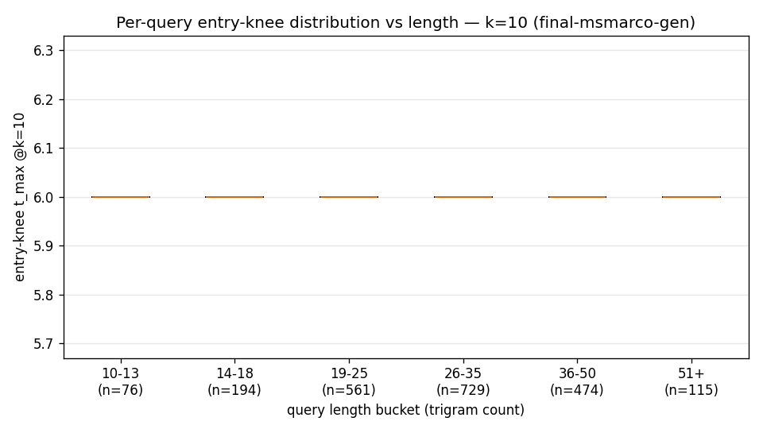
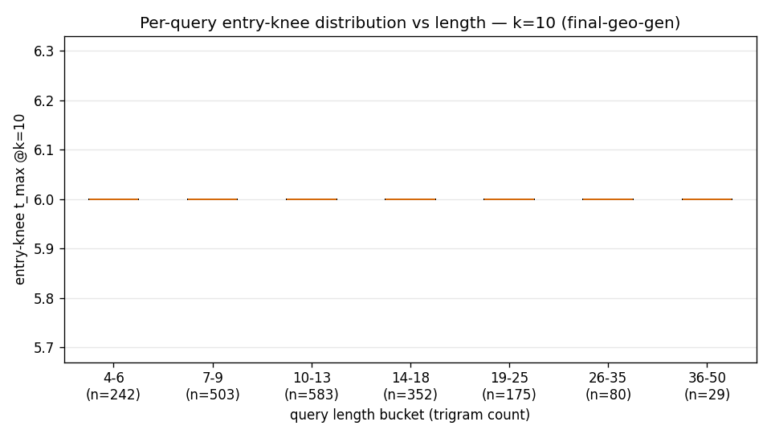
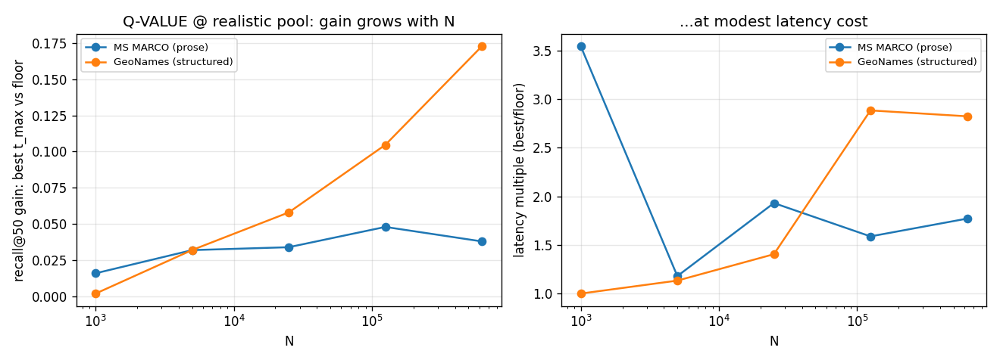
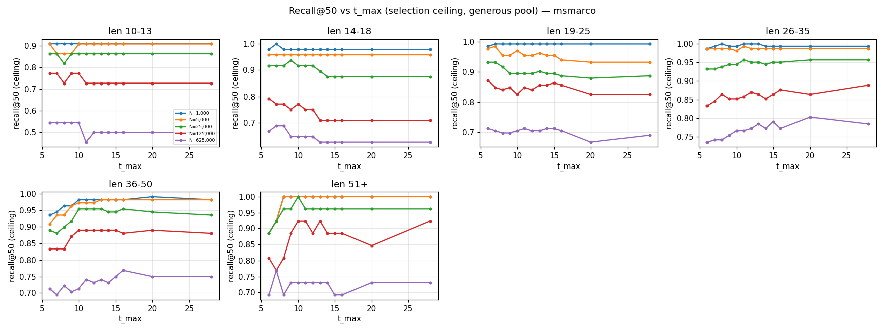
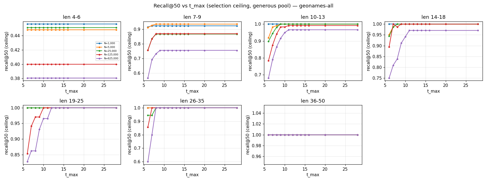
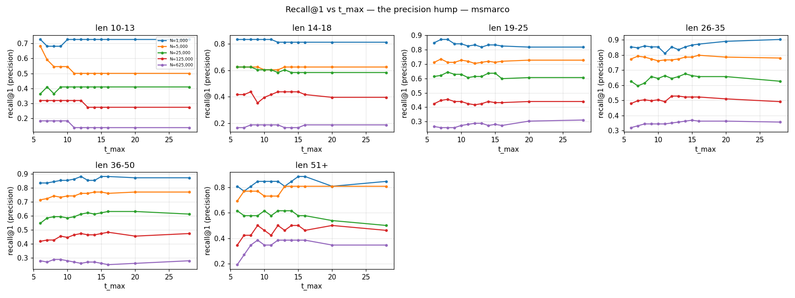
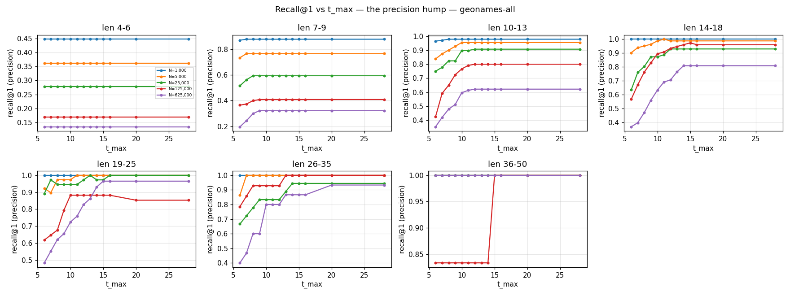

# `t_max` selection-cap characterization

`t_max` caps how many of a query's trigrams the rarest-first selector keeps. It always keeps at
least the typo floor `F = m + d = 6`, and never more than `t_max`. A higher cap lets more
candidates clear the overlap floor and reach the rerank pool. But the extra trigrams it admits
are the common ones (high document-frequency), which are slow to scan and add noise to the
overlap counts. So the cap trades recall for latency. Three questions decide what it should be:

- Does the best cap depend on query length?
- Does it change with corpus size `N`?
- Is a cap above the floor worth the latency it costs?

The sweep covers two very different corpora: MS MARCO (long, sparse prose) and GeoNames
all-countries (short, dense names), at sizes from 1k to 1M documents.

## Method

Recall is measured per query, as a knee. Averaging recall across queries at each `t_max` would
be misleading here: different queries reach their knee at different `t_max` values, so the
average smooths them into a gentle slope even when every query has a sharp knee. And if query
length lines up with where the knee falls, that smoothing can look like a length law that isn't
real. The per-query measurements avoid this:

- `t_enter(q, k)`: the smallest `t_max` that brings `q`'s relevant document into the top k.
- `t_exit(q, k)`: the largest `t_max` that still keeps it there. Above this it drops out again,
  and that span is the per-query hump.
- Queries that never recover at any `t_max` are right-censored. They are reported as a recovery
  rate rather than dropped, since dropping them would bias the results toward easy queries.

`t_max` affects recall in two ways, and two pool sizes pull them apart:

- A generous pool (`2·√(50·N)`, capped) measures selection on its own. The relevant document
  is in the pool at any `t_max`, so `t_max` only changes how selection ranks it.
- A production pool (`Effort::Medium`, `0.05·√(50·N)`) is the size a real query uses. Here
  `t_max` also decides whether the document gets into the pool at all, which is where most of
  its effect is.

Corpus sizes are 1k, 5k, 25k, 125k, and 625k, plus a single run at 1M. (At 1M, doubling the
pool moved the recall ceiling by only ±0.007, so the one run is enough.) The `t_max` values
tested are closely spaced from 6 to 16, plus 20 and 28. Confidence intervals are bootstrapped,
computed in linear space.

## Length dependence

Slope of the entry knee against query length (`t_max` per trigram), with 95% confidence interval:

| | MS MARCO | GeoNames |
|---|---|---|
| k=10 | `+0.010 [+0.005, +0.017]` (span +0.8 `t_max`) | `+0.005 [+0.001, +0.009]` (span +0.2) |
| k=50 | `+0.010 [+0.004, +0.016]` (span +0.8) | `+0.001 [-0.001, +0.004]` (no effect) |

The slope is positive: longer queries have a slightly higher knee, mostly because a few very
long queries pull the average up. But across the whole range of lengths the knee moves by less
than one `t_max`, which is too small to matter. On GeoNames at k=50 there is no measurable
effect, and the sample is big enough that a real one would show. Neither corpus has a length
law.

## Drift with corpus size

The median `t_enter` at k=10, split by query-length bucket and corpus size, sits at the floor
(6) in every cell. This holds for both corpora and every `N` from 1k to 1M:

```
MS MARCO    len 10-13  14-18  19-25  26-35  36-50  51+
  N=1k          6      6      6      6      6      6
  N=625k        6      6      6      6      6      6
  N=1M          6      6      6      6      6      6
GeoNames    len 4-6  7-9  10-13  14-18  19-25  26-35  36-50
  N=1k..1M    6    6     6      6      6      6      6     (every cell)
```

So the typical query recovers at the floor, whatever its length or the corpus size. You might
expect a bigger corpus to want fewer trigrams, since more documents means more accidental
matches on common ones. That does happen, but only to a tail of queries (the hump, below), and
it never moves the median.




The boxes sit on the floor; only the top whisker grows with query length. The median is the
floor, and the small length effect that exists is all in the tail.

## Value above the floor

Recall@50 at the production pool. Each cell gives the gain over the floor (`t=6`), the `t_max`
that achieves it (in parentheses), and the latency cost compared with the floor.

| N | MS MARCO gain (best `t`) @ latency× | GeoNames gain (best `t`) @ latency× |
|---|---|---|
| 1k | +0.016 (11) @3.5× | +0.002 (7) @1.0× |
| 25k | +0.034 (16) @1.9× | +0.058 (9) @1.4× |
| 125k | +0.048 (13) @1.6× | +0.105 (11) @2.9× |
| 625k | +0.038 (14) @1.8× | +0.173 (12) @2.8× |
| 1M | +0.067 (10) @1.4× | +0.224 (14) @4.2× (sub-ms) |

This is the biggest recall effect anywhere in either report, and it grows with `N`. On GeoNames
the gain reaches +0.17 at 625k documents and +0.22 at 1M. The best `t_max` stays small and
roughly fixed (about 8 to 16) in both corpora at every size; only the recall it buys grows. The
latency cost is small: 1 to 4 times the floor, and under a millisecond for GeoNames.

This effect only appears at the production pool. At the generous pool the right document is
already included whatever `t_max` is, so changing `t_max` moves recall by about 2 points while
costing 12 to 26 times the latency, which makes it look minor. The production pool is small
enough that `t_max` decides whether the document gets in, and that is where the recall comes
from.



## The hump

Fraction of queries that reach the top k and then drop out again when `t_max` is pushed up to
28. This grows with `N` on prose and stays near zero on names:

| drop-out @k=10 | N=1k | N=125k | N=625k | N=1M |
|---|---|---|---|---|
| MS MARCO | 0.018 | 0.105 | 0.107 | 0.148 |
| GeoNames | 0.000 | 0.005 | 0.012 | 0.022 |

In prose, a handful of trigrams are very common and the rest are rare. Once `t_max` runs past
the rare trigrams in a query, it starts adding common ones. Common trigrams match many unrelated
documents, and that extra noise can push the right document back out of the top k. A bigger
corpus has more documents to supply the noise, so the effect grows with `N`. Names have far
fewer common trigrams, so it barely happens. Either way, setting `t_max` above the best value
only costs recall.

This also backs up the [pool-depth report](../pool-law). That report uses the same fact about
common trigrams to predict that a bigger corpus pushes the right document lower in prose, but
not in names. The hump measures that same effect a different way, with a different statistic on
a different sweep, and finds the same split between the two corpora. So the result does not rest
on a single measurement.






## Recovery

How often the right document can be found at all (generous pool, any `t_max`). This falls as
`N` grows. It is reported separately from the knee numbers above:

| recall-ever @50 | 1k | 25k | 125k | 625k | 1M |
|---|---|---|---|---|---|
| MS MARCO | 0.992 | 0.966 | 0.904 | 0.802 | 0.770 |
| GeoNames | 0.856 | 0.820 | 0.813 | 0.761 | 0.737 |

At small `N`, GeoNames recovers worse than MS MARCO (0.856 versus 0.992 at 1k), even though the
dense corpus should be the easier one. This is about how the queries are built, not the index.
GeoNames queries are short names with two edits added. Two edits damage a much larger share of a
short name's trigrams than of a long passage: a 6-character name has about 4 trigrams and two
edits can wreck most of them, while the same two edits touch only a few of a passage's dozens.
For about 14% of GeoNames queries, too little of the original name survives to find it at any
`t_max` (or what survives now matches a different real name), so those queries fail at any corpus
size. MS MARCO uses real paraphrase queries, which are almost all recoverable at 1k. The gap
comes from adding edits to short strings.

## Two regimes

| | MS MARCO (prose / sparse) | GeoNames (structured / dense) |
|---|---|---|
| Median entry-knee (all N ≤ 1M) | floor (6) | floor (6) |
| Length law @k=50 | tiny (`+0.010`, span +0.8) | null (`+0.001`) |
| Hump (drop@10) at 1M | 0.148 (large) | 0.022 (tiny) |
| Above-floor gain @ production pool, 625k | +0.048 | +0.173 |
| Best fixed `t_max` | ~8–16 | ~7–12 |

The two corpora are very different, and they agree on the shape of the answer: a small fixed
best value, no length law, and no change in the median with corpus size. The length law you
seem to get from averaging recall is an artifact of the averaging; the per-query knee removes
it.

## Conclusion

`t_max` matters a lot. The recall it buys above the floor is the largest single effect in
either report, and it grows with the corpus, up to +0.22 at 1M documents on GeoNames. The best
value for `t_max` does not change: it stays small (about 8 to 16) in both corpora at every size.
The corpus only changes how much that fixed value is worth.

Two things can make `t_max` look unimportant. The median query recovers at the floor in every
case, and at a large diagnostic pool the right document is already included, so `t_max` moves
recall by only about 2 points. Both are misleading. The effect is real, and it shows at the
smaller pool a real query uses, where `t_max` decides whether the right document is included.

| question | finding | implication |
|---|---|---|
| length | real, but under 1 `t_max` across all lengths | don't scale `t_max` by length |
| corpus size | median knee = floor at every `N` up to 1M | no rule that varies `t_max` with `N` |
| value | large, grows with `N` (up to +0.22 at 1M on names) | one fixed cap captures it |
| Effort | dropping to the floor costs up to 0.17–0.22 recall (GeoNames) | Effort must not lower `t_max` |

`t_max = 12` is a good fixed choice. It is at or above the best value for both corpora at every
size (MS MARCO about 10 to 16, GeoNames about 7 to 14), so it gets almost all of the large gain
on names, stays within about one recall point of the best value on prose, and stays below the
point where the prose hump starts costing recall. No rule that depends on query length or corpus
size does better. The largest gains are on short, structured records rather than long prose,
which is the kind of data trifle is built for. Lowering `t_max` toward the floor at a low
`Effort` setting would give back up to 0.17 to 0.22 of recall, so `Effort` should leave `t_max`
alone.

## Reproduce

```bash
# generous pass (ceiling + per-query knees) and realistic pass (above-floor value), per corpus:
python3 benchmarks/tools/tmax_knee.py --corpus msmarco \
    --docs 1000,5000,25000,125000,625000 --queries 500 --max-tmax 28 --out OUT-gen
python3 benchmarks/tools/tmax_knee.py --corpus msmarco \
    --docs 1000,5000,25000,125000,625000 --queries 500 --max-tmax 28 \
    --pool-coef 0.05 --pool-floor 50 --out OUT-real
python3 benchmarks/tools/tmax_perquery.py --csv OUT-gen/tmax_raw.csv --out OUT-gen/perquery
# (geonames-all: same with --corpus geonames-all --edits 2)
```

Tooling: `benchmarks/src/main.rs` (`tmaxsweep`), `benchmarks/tools/tmax_knee.py` (sweep
driver, peak-based facets), `benchmarks/tools/tmax_perquery.py` (the per-query knee
statistic). The corpus sizes 1k, 5k, 25k, 125k, 625k are the standard set for these sweeps.
